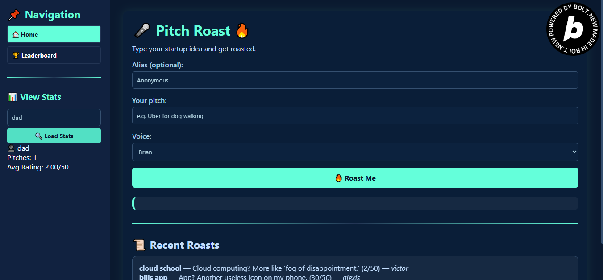
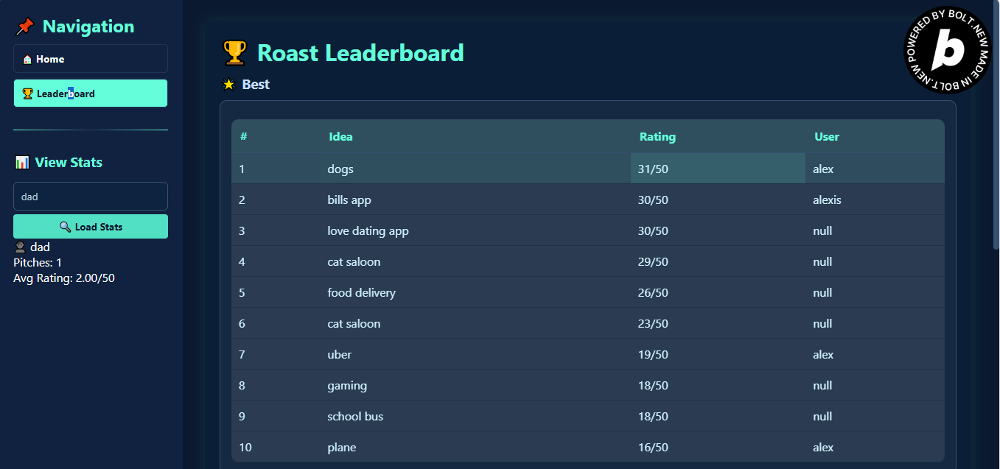

# Pitch Roast 🔥

A brutally honest startup pitch feedback app built with pure HTML, CSS, and vanilla JavaScript frontend, powered by a Node.js Express backend.





## Features

### Frontend (Pure HTML/CSS/JS)
- **Dark Theme**: Professional navy background with teal and blue accents
- **Responsive Design**: Fixed sidebar on desktop, horizontal navigation on mobile
- **Pitch Submission**: Submit startup pitches with optional alias and voice selection
- **Roast Display**: Get humorous feedback with ratings and audio playback
- **Leaderboard**: View best, worst, and recent roasts from the community
- **Statistics**: Community stats including total roasts, average ratings, and top contributors
- **Audio Playback**: Text-to-speech integration for roast responses


### Backend (Node.js + Express)
- **RESTful API**: Clean endpoints for all frontend interactions
- **Supabase Integration**: Database storage for roasts, ratings, and user data
- **Intelligent Roasting**: Keyword-based roast generation with rating system
- **Leaderboard System**: Dynamic ranking of best and worst roasts
- **Statistics Engine**: Real-time community statistics
- **Audio Generation**: TTS integration ready (placeholder implemented)
- **CORS Enabled**: Cross-origin support for frontend-backend communication

## Tech Stack

### Frontend
- **HTML5**: Semantic markup with modern structure
- **CSS3**: Custom properties, flexbox, grid, animations, and responsive design
- **Vanilla JavaScript**: ES6+ features, fetch API, and DOM manipulation
- **No Frameworks**: Pure web technologies for maximum performance

### Backend
- **Node.js**: Runtime environment
- **Express.js**: Web application framework
- **Supabase**: Database and authentication
- **CORS**: Cross-origin resource sharing

## Setup Instructions

### Prerequisites
- Node.js (v16+)
- Supabase account
- Git

### Backend Setup
1. Clone the repository and navigate to the project directory
2. Install dependencies:
   ```bash
   npm install express cors @supabase/supabase-js
   ```
3. Set up environment variables:
   ```bash
   # Create .env file
   SUPABASE_URL=your_supabase_project_url
   SUPABASE_ANON_KEY=your_supabase_anon_key
   PORT=3000
   ```
4. Create the database schema in Supabase:
   ```sql
   -- Create roasts table
   CREATE TABLE roasts (
     id UUID DEFAULT gen_random_uuid() PRIMARY KEY,
     pitch_text TEXT NOT NULL,
     roast_text TEXT NOT NULL,
     rating INTEGER NOT NULL CHECK (rating >= 1 AND rating <= 5),
     alias VARCHAR(100) NOT NULL,
     voice VARCHAR(20) NOT NULL,
     created_at TIMESTAMP WITH TIME ZONE DEFAULT NOW()
   );

   -- Create average rating function
   CREATE OR REPLACE FUNCTION get_average_rating()
   RETURNS TABLE(avg_rating NUMERIC) AS $$
   BEGIN
     RETURN QUERY
     SELECT AVG(rating::NUMERIC) FROM roasts;
   END;
   $$ LANGUAGE plpgsql;

   -- Enable Row Level Security
   ALTER TABLE roasts ENABLE ROW LEVEL SECURITY;

   -- Create policy for public read access
   CREATE POLICY "Allow public read access" ON roasts
     FOR SELECT USING (true);

   -- Create policy for public insert access
   CREATE POLICY "Allow public insert access" ON roasts
     FOR INSERT WITH CHECK (true);
   ```
5. Start the development server:
   ```bash
   npm run dev
   ```

### Frontend Setup
1. Update the API base URL in `roast.js`:
   ```javascript
   const API_BASE_URL = 'http://localhost:3000'; // For local development
   // const API_BASE_URL = 'https://your-backend.render.com'; // For production
   ```
2. Serve the frontend files using any static server or open `index.html` directly

### Deployment

#### Frontend (Netlify)
1. Build your static files
2. Deploy to Netlify by dragging the folder to the deploy area
3. Update the API base URL to point to your production backend

#### Backend (Render)
1. Create a new Web Service on Render
2. Connect your GitHub repository
3. Set environment variables in Render dashboard
4. Deploy with build command: `npm install`
5. Start command: `npm start`

## API Endpoints

### POST /api/roast
Submit a pitch and receive a roast response.

**Request Body:**
```json
{
  "text": "Your startup pitch here",
  "alias": "Your Name (optional)",
  "voice": "male|female|robot"
}
```

**Response:**
```json
{
  "id": "uuid",
  "text": "Generated roast text",
  "rating": 4,
  "audioUrl": null,
  "timestamp": "2024-01-01T00:00:00Z",
  "alias": "Your Name",
  "voice": "male"
}
```

### GET /api/leaderboard/:type
Get leaderboard data (type: best, worst, recent).

**Response:**
```json
[
  {
    "id": "uuid",
    "text": "Roast text",
    "rating": 5,
    "alias": "Author Name",
    "timestamp": "2024-01-01T00:00:00Z",
    "pitch": "Original pitch excerpt..."
  }
]
```

### GET /api/stats
Get community statistics.

**Response:**
```json
{
  "totalRoasts": 1234,
  "avgRating": "3.8",
  "topScorer": "RoastMaster",
  "brutalCount": 456
}
```

## Customization

### Adding New Roast Templates
Edit the `roastTemplates` array in `server.js`:

```javascript
{
  keywords: ['your', 'keywords', 'here'],
  roasts: [
    "Your hilarious roast here",
    "Another roast option",
    "Third roast variation"
  ],
  ratings: [4, 5, 3] // Corresponding ratings
}
```

### Styling Customization
Modify CSS custom properties in `roast.css`:

```css
:root {
  --navy-dark: #1a1a2e;
  --teal-primary: #16a085;
  /* Add your custom colors */
}
```

### Audio Integration
Replace the placeholder audio generation in `server.js` with your preferred TTS service:
- Google Cloud Text-to-Speech
- Amazon Polly
- Azure Cognitive Services Speech
- OpenAI TTS API

## Performance Features

- **Optimized Loading**: Lazy loading for leaderboard sections
- **Responsive Images**: Proper scaling for all device sizes
- **Efficient DOM Updates**: Minimal reflows and repaints
- **Caching Strategy**: Smart data caching to reduce API calls
- **Progressive Enhancement**: Works without JavaScript for basic functionality

## Security Features

- **Input Validation**: Server-side validation of all inputs
- **Rate Limiting**: Protection against spam submissions
- **CORS Configuration**: Properly configured cross-origin requests
- **SQL Injection Prevention**: Parameterized queries via Supabase
- **XSS Protection**: Input sanitization and output encoding

## Browser Support

- Chrome 80+
- Firefox 75+
- Safari 13+
- Edge 80+
- Mobile browsers (iOS Safari, Chrome Mobile)

## Contributing

1. Fork the repository
2. Create a feature branch: `git checkout -b feature-name`
3. Commit changes: `git commit -am 'Add feature'`
4. Push to branch: `git push origin feature-name`
5. Submit a pull request

## License

MIT License - feel free to use this project for personal or commercial purposes.

## Support

For questions or issues, please create an issue in the GitHub repository.

---

